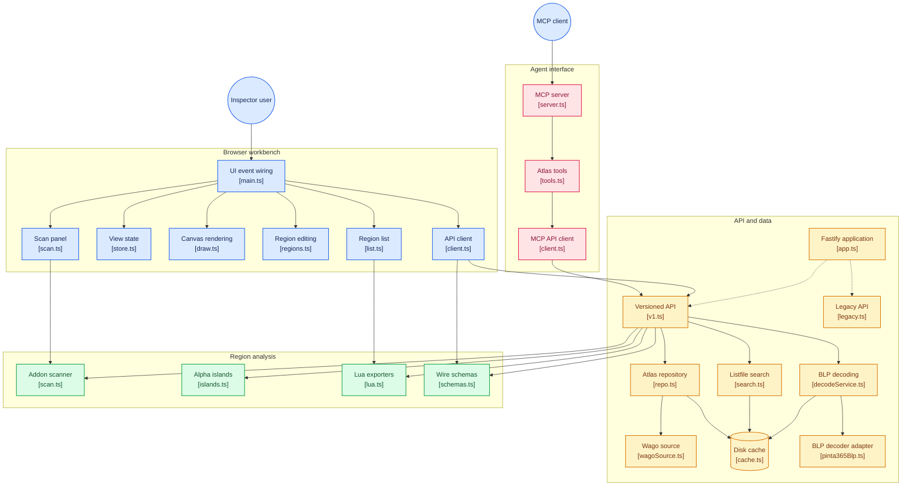

# Atlas Inspector

Inspect WoW texture atlases (`UI/*.xml` / `.blp` sheets) by **FileDataID**: visualize region rectangles, group them by prefix, search names, and export ready-to-paste Lua region tables for your addons.

Ships as a local web app: a **Fastify + TypeScript API** (Node.js) with a **strict TypeScript, dependency-light client** (no framework — a vanilla Vite build on a single canvas). Everything runs on your machine; atlas data is fetched on demand from [wago.tools](https://wago.tools).

  

---

## Features

- **Inspect mode** — paste a FileDataID, pick a build, and see the full atlas texture with every region outlined. Hover a region in the list to highlight it on the canvas; click a row to select and copy its Lua entry.
- **Define mode** — drop a PNG sheet anywhere on the page and draw regions with the mouse; rename, drag-resize, re-copy or delete them, then grab the whole table as Lua. Press **Auto** to generate regions from the sheet's alpha islands (connected blobs, small noise filtered) before drawing anything.
- **Grouped colors** — regions sharing the same 2-part prefix (`ui/button/*`) get the same highlight color, on the canvas and in the list.
- **Name filter** — filter the region list as you type; the row counter and legend stay in sync.
- **Exports** — per-region and whole-atlas **Lua** (`{ PACK, w, h, left/W, right/W, top/H, bottom/H }`) and **JSON**, clipboard-friendly.
- **Atlas scanner** — drop your addon code (`.lua`, `.xml`, `.txt`, `.toc`) or paste it: every region table and `SetTexCoord` call is detected, matched against the current atlas with pixel-exactness per corner, and located on the canvas. Flips, sub-pixel edges and nine-slice margins are flagged.
- **Export styles** — the Lua emitter supports `coords`, `atlasinfo`, `sheetfirst` and `xml` variants next to the legacy `default` format, selectable in the toolbar; the scan panel copies each detected region in the chosen style.
- **Handles textures too** — non-atlas files (single `.blp` textures) are shown with metadata and a download link, including their preview.
- **API docs** — Swagger UI served at `/documentation`.

## How it works



- The API validates every response through shared zod schemas (`src/shared/`), exposed to both server and client — there is a single source of truth for the wire contract.
- The Lua export format is a **single shared implementation** (`src/shared/lua.ts`) used by the client, the server and the agent, so every surface emits the exact same bytes. Five output styles (`default`, `coords`, `atlasinfo`, `sheetfirst`, `xml`) share the same emitter.
- Addon-code scanning (`src/shared/scan.ts`) and alpha-island detection (`src/shared/islands.ts`) are also shared, pure modules — the client renders and validates everything locally.
- Lookups are backed by an on-disk cache (`cache/`) with TTLs, so repeat visits are fast and the app stays usable offline for previously fetched data.
- No user data, no telemetry, no external service account: the app is fully read-only toward upstream.

### The two API surfaces

| Surface | Prefix    | Purpose                                                                                                                             |
| ------- | --------- | ----------------------------------------------------------------------------------------------------------------------------------- |
| **v1**  | `/api/v1` | The modern, schematized API — **the client only talks to this** (ADR-013).                                                          |
| legacy  | `/api`    | Historical v0 endpoints kept for backward compatibility (old clients, `/api/cache/…` decoded PNGs). New features should land in v1. |

## Prerequisites

- **Node.js ≥ 22.12.0** (any OS: Windows, macOS, Linux — this is the only runtime needed).
- **npm** (bundled with Node). No system packages, no native build steps.

> On Windows, all commands below work as-is from PowerShell/CMD or Git Bash.

## Quick start

```bash
# 1. install dependencies (first time only)
npm install

# 2. run — the launcher auto-builds the production bundle the first time,
#    then starts the server and serves both API and client
node start.mjs          # or: npm start
```

Then open <http://127.0.0.1:8000> — Swagger docs live at <http://127.0.0.1:8000/documentation>.

Try it: type a FileDataID (e.g. `5548240`) and press **Find atlas**.

### Options

```bash
PORT=9000 node start.mjs          # change the port / HOST=0.0.0.0 to bind all
LOG_LEVEL=debug node start.mjs    # verbose logs (for pino, JSON to stdout)
node start.mjs --dev              # run straight from source with tsx + hot reload
```

> `--dev` needs the `devDependencies` installed (default `npm install` includes them).

## Development workflow

```bash
npm run dev:server    # API from source with tsx watch (hot reload)
npm run dev:client    # Vite dev server (proxies /api to :8000) for UI work
npm test              # all unit + integration + client tests (vitest)
npm run typecheck     # strict tsc across client (and server via tsconfig.server.json)
npm run lint          # eslint
npm run build         # server (tsc) + client (vite) into dist/
npm run format        # prettier --write
```

### Nice to know

- The production client build (`npm run dev:client` → `vite build`) emits into `dist/client/`; the server serves **only** that folder. The legacy prototype files at the repo root (`app.js`/`server.js`/`index.html`/`styles.css`) were removed once the TS client/serializer reached parity.
- The quick-launch script `start.mjs` reuses that built bundle when present and only compiles on first run. Force a rebuild with `npm run build`.
- Port is `8000` by default (matches the Vite dev proxy). All settings live in [Configuration](#configuration).

## Configuration

Read from the environment (or a `.env` file next to the repo root — supported out of the box by Node ≥ 20.6):

| Variable                        | Default                          | Meaning                                                     |
| ------------------------------- | -------------------------------- | ----------------------------------------------------------- |
| `PORT`                          | `8000`                           | HTTP listen port                                            |
| `HOST`                          | `127.0.0.1`                      | Listen address (`0.0.0.0` to expose on the LAN)             |
| `LOG_LEVEL`                     | `info`                           | `trace`/`debug`/`info`/`warn`/`error`/`fatal`               |
| `LOG_PRETTY`                    | `1`                              | prettified pino logs when `1`/`true`                        |
| `ATLAS_ROOT`                    | auto                             | project root (overrides the auto-detected repo location)    |
| `WAGO_BASE_URL`                 | `https://wago.tools`             | upstream data source base                                   |
| `WAGO_USER_AGENT`               | `atlas-inspector/0.2.0 …`        | UA sent upstream                                            |
| `UPSTREAM_TIMEOUT_MS`           | `30000`                          | upstream request timeout                                    |
| `UPSTREAM_MAX_RETRIES`          | `5`                              | retries for recoverable upstream errors                     |
| `DB_CACHE_TTL_MS`               | `86400000`                       | cache TTL for DB2/listfile lookups                          |
| `BLP_MAX_BYTES`                 | `67108864`                       | max accepted `.blp` payload size                            |
| `LISTFILE_PATH`                 | `cache/listfile.csv`             | local listfile for name lookups if configured               |
| `LISTFILE_URL`                  | community-listfile release asset | where the index is downloaded from (air-gapped mirrors)     |
| `LISTFILE_RELEASE_API`          | GitHub `releases/latest`         | release metadata used to pin downloads and detect staleness |
| `LISTFILE_CHECK_INTERVAL_HOURS` | `7`                              | how often the server checks for a newer release (min 7)     |
| `LISTFILE_WAIT_MAX_MS`          | `25000`                          | ceiling for `?wait=` on `/api/v1/search`                    |

## API (v1)

All v1 endpoints are schematized (zod); failing lookups return [RFC 9457 Problem+JSON](https://www.rfc-editor.org/rfc/rfc9457) with HTTP status codes.

| Method | Path                                 | Description                                                                                                                         |
| ------ | ------------------------------------ | ----------------------------------------------------------------------------------------------------------------------------------- |
| `GET`  | `/api/v1/health`                     | Liveness + version.                                                                                                                 |
| `GET`  | `/api/v1/builds`                     | Selectable game builds (offline fallback list + live merge).                                                                        |
| `GET`  | `/api/v1/files/:fdid`                | File metadata for a FileDataID.                                                                                                     |
| `GET`  | `/api/v1/files/:fdid/blp`            | Download the raw `.blp` file.                                                                                                       |
| `POST` | `/api/v1/blp/decode`                 | Decode a raw `.blp` **body**; returns a cached `pngUrl`. Send raw bytes, not a multipart form.                                      |
| `POST` | `/api/v1/blp/islands`                | Raw `.blp` body → opaque islands as px rects. `?gap=` (0–32, default 1) and `?minpx=` (default 16) tune the detection.              |
| `POST` | `/api/v1/blp/alpha`                  | Raw `.blp` body → first opaque row/column per side (nine-slice margins).                                                            |
| `POST` | `/api/v1/blp/tc`                     | JSON `{ width, height, px\|tc }` → pixel rect **and** `SetTexCoord`, normalized or integer-over-dimension.                          |
| `GET`  | `/api/v1/atlas/:fdid?build=`         | Atlas lookups: `atlas` (region list), `texture` (not an atlas) or `missing`.                                                        |
| `GET`  | `/api/v1/atlas/:fdid/regions`        | Region names only (lightweight).                                                                                                    |
| `GET`  | `/api/v1/atlas/:fdid/export`         | Whole-atlas Lua export.                                                                                                             |
| `GET`  | `/api/v1/search?q=[&limit=][&wait=]` | Community listfile search. Read-only: never downloads (see below); `wait` is **seconds** (0–25) to ride out an in-flight download.  |
| `POST` | `/api/v1/listfile/fetch`             | Start (or reuse) the listfile download. `{ wait?: 0–25 }`, default `0` = acknowledge now. **The only route that writes the index.** |
| `POST` | `/api/v1/scan`                       | Addon-code scanner: `{ code, sheet? }` → normalized region entries (px rects, exactness, matched atlas member, `SetTexCoord`).      |

Interactive docs: `/documentation` (Swagger UI).

### Consuming from an agent

The app is a local read-only HTTP service — any agent with web/HTTP access can consume it:

```sh
# app must be running (node start.mjs → http://127.0.0.1:8000)
curl -s http://127.0.0.1:8000/api/v1/health

# atlas region list for a FileDataID (PetBattleHUDAtlas sheet)
curl -s "http://127.0.0.1:8000/api/v1/atlas/878877"

# scan addon code and normalize it against a 256×256 sheet
curl -s -X POST http://127.0.0.1:8000/api/v1/scan \
  -H 'content-type: application/json' \
  -d '{"code":"[\u0027Icon\u0027] = { \u0027Interface\\\\Icons\\\\Foo\u0027, 0, 0.5, 0, 0.5 } ,","sheet":{"width":256,"height":256,"members":[{"name":"Foo\\Icon","left":0,"top":0,"right":128,"bottom":128}]}}'

# whole-atlas Lua export (same bytes the UI emits)
curl -s "http://127.0.0.1:8000/api/v1/atlas/878877/export"
```

#### Working with a local `.blp` file

The `/blp/*` endpoints take the **raw file as the request body**. A multipart
form upload sends the form envelope, not the texture, so `curl -F` fails — the
response names the offending bytes (`Body is not a BLP file: it starts with
"----"`). Send raw bytes:

```sh
# decode a local sheet
curl -s --data-binary @RarityGemAtlas.blp \
  -H 'Content-Type: application/octet-stream' \
  http://127.0.0.1:8000/api/v1/blp/decode

# find every opaque region in it (no FileDataID needed)
curl -s --data-binary @RarityGemAtlas.blp \
  -H 'Content-Type: application/octet-stream' \
  http://127.0.0.1:8000/api/v1/blp/islands
```

Both BLP1 and BLP2 decode. A failure that says "not a BLP file" means the
payload was not a BLP; a failure that says "BLP decode failed for a valid BLP2
header" means the bytes _are_ a BLP and the codec could not expand that one.
The two are never conflated, because guessing wrong here costs an afternoon
chasing a decoder bug that does not exist.

The request/response contract is the single source of truth in `src/shared/schemas.ts`; `/documentation` renders it live. Cache under `cache/` makes repeated agent runs fast and offline for previously fetched data.

#### Name search on a fresh install (the index asks before it downloads)

`cache/listfile.csv` is a ~146 MB index of every texture name in the game. It is not in the
repo, so on a first install it is always missing — and an MCP agent has no shell to fetch it.
The app can build it, but it will not do so behind your back: **no request ever triggers a
download.** `GET /api/v1/search` and `GET /api/v1/health` are side-effect free by
construction; they only read what is already on disk.

To get the index, you approve the download once:

- In an agent session, call the `atlas_prepare_index` MCP tool. It opens a confirmation prompt
  naming the size, the source, and where the file lands. Only an explicit accept downloads;
  declining, cancelling, or a client that cannot be asked means no download, and the answer
  tells you to run `npm run fetch:listfile` instead.
- By hand: `npm run fetch:listfile`, or `curl -X POST localhost:8000/api/v1/listfile/fetch`.
- Pre-seeded installs need nothing at all: copy a `cache/` directory from another machine and
  search works offline.

Once approved, the rest is mechanical and safe:

- One download per process, written to a `.tmp` file and renamed into place, so an interrupted
  run never leaves a corrupt index behind.
- The download is pinned to the release tag that was current when it started, and that tag is
  recorded next to the file (`cache/listfile.csv.meta.json`).
- The server checks for a newer release every 7 hours (a ~14 KB metadata poll, never a
  download) and reports `updateAvailable` when your copy is behind. Staleness is reported, not
  silently fixed.
- `GET /api/v1/health` reports real readiness under `capabilities.search` — `ready`, `indexing`,
  `absent` or `error` — instead of a flat `"ok"` that hides a dead search.
- `GET /api/v1/search` **never** returns 503 for a missing index. It returns `200` with
  `status` and an actionable `detail`, so a client can retry rather than crash.
- `?wait=<seconds>` (0–25) blocks just long enough to ride out a nearly-finished download. It is
  never held open for the whole transfer, and giving up does not cancel it.

Every other tool works while the index is missing. See ADR-020 in [docs/ADRs.md](docs/ADRs.md).

### MCP server (opencode / Claude Desktop)

The same v1 surface ships as a Model Context Protocol server (`src/mcp/`) with one tool per endpoint, all prefixed `atlas_`: `atlas_server_status`, `atlas_list_builds`, `atlas_search`, `atlas_file_info`, `atlas_get`, `atlas_regions`, `atlas_export`, `atlas_scan`, and `atlas_prepare_index`. Addons can inspect WoW texture atlases, resolve FileDataIDs by name, export Lua and scan addon code directly from the assistant.

All of them are read-only except `atlas_prepare_index`, which asks you before downloading the
name index. On a cold install `atlas_server_status` says **DEGRADED** with
`capabilities.search.status: "absent"`, and `atlas_search` returns an error rather than an empty
hit list — an empty list would otherwise read as "no such texture". `atlas_search` then tells you
to run `atlas_prepare_index`, which prompts for confirmation; or pass `wait: 25` to `atlas_search`
when a download is already in flight.

**Prerequisites — do this once:**

```bash
npm install
npm run build          # builds dist/server + dist/client + dist/mcp
```

The MCP is a thin stdio/HTTP wrapper over the app's `/api/v1`. It **auto-starts the app** on boot: it health-checks `ATLAS_URL` (default `http://127.0.0.1:8000`) and, if the app is not reachable at a loopback address, spawns `node start.mjs` detached and waits for `/api/v1/health` to answer. No need to run it by hand before opening opencode/Claude. Set `ATLAS_AUTOSTART=0` to opt out (or point `ATLAS_URL` at a remote host, which is never auto-started). Manual usage is unchanged — `node start.mjs` works standalone and the app it spawns keeps running after the assistant exits.

**opencode** — add this to your opencode config (`~/.config/opencode/opencode.json` global, or a project-local `opencode.json`):

```json
{
    "mcp": {
        "atlas-inspector": {
            "type": "local",
            "command": ["node", "/absolute/path/to/atlas-inspector/dist/server/mcp/index.js"],
            "environment": { "ATLAS_URL": "http://127.0.0.1:8000" },
            "enabled": true
        }
    }
}
```

**Claude Desktop** — add the same entry to `claude_desktop_config.json` (`%APPDATA%\Claude\claude_desktop_config.json` on Windows, `~/Library/Application Support/Claude/claude_desktop_config.json` on macOS):

```json
{
    "mcpServers": {
        "atlas-inspector": {
            "command": "node",
            "args": ["/absolute/path/to/atlas-inspector/dist/server/mcp/index.js"],
            "env": { "ATLAS_URL": "http://127.0.0.1:8000" }
        }
    }
}
```

Restart the assistant after editing the config, then try: `ask the atlas server for region _BattleBar-Mid in FileDataID 878877`. Errors already include the fix (e.g. "start it with `node start.mjs`") when the app is unreachable.

Developers can iterate without a client: `npm run start:mcp:http` exposes the same tools as streamable HTTP at `http://127.0.0.1:8087/mcp` (`MCP_HOST`/`MCP_PORT`/`ATLAS_URL` env vars) for remote or debugging clients.

#### Giving the MCP a local `.blp`

`atlas_blp_islands` and `atlas_blp_alpha` take a `blp` argument that is **either
a filesystem path or base64 bytes** — whichever is easier for you. A path is
read from disk and encoded for you, so there is no `base64 -w0` step and no
30k-character argument to paste:

```
atlas_blp_islands { "blp": "/home/you/textures/RarityGemAtlas.blp" }
atlas_blp_islands { "blp": "./Atlas.blp" }
atlas_blp_islands { "blp": "file:///home/you/textures/Atlas.blp" }
atlas_blp_islands { "blp": "QkxQMgEAAAACC…" }   // base64 still works
```

The argument is validated before anything is sent: a readable `.blp` is
required, a `BLP1`/`BLP2` magic is enforced, and files over 64 MB are refused.
Invalid input comes back as a specific error (`Invalid \`blp\` input: … cannot be
read`, or `… starts with "{. ", not BLP1/BLP2`) rather than a generic format
complaint — so a bad argument is never mistaken for an unsupported BLP version.

Regions come back as pixel bounding boxes, **not names**: a local `.blp` does
not carry region names, those only exist for wago.tools atlases resolved by
FileDataID. Pipe the rects into `atlas_blp_tc` to get the `SetTexCoord` lines, or
into `atlas_scan`'s `sheet.members` to match them against real member names:

```
atlas_blp_islands { "blp": "./RarityGemAtlas.blp" }
  → 128×128, 12 island(s): 32×32 at (64,0); 24×30 at (4,2); 16×23 at (8,37) …

atlas_blp_tc { "width": 128, "height": 128, "px": { "x": 8, "y": 37, "w": 16, "h": 23 } }
  → :SetTexCoord(8/128, 24/128, 37/128, 60/128)
```

## Data & caching

All durable state lives under `cache/` at the project root:

```
cache/
├── listfile.csv     # optional local listfile for name lookups
├── db/              # source data from DB2/metadata lookups (TTL-managed)
├── decode/          # decoded PNGs (served back via /api/cache/decode_*.png)
└── render/          # rendered atlas sheets
```

First fetch of a FileDataID goes to wago.tools; everything after that is served from cache until the TTL expires.

## Project structure

```
├── src/
│   ├── client/          # browser client (strict TS, no framework)
│   │   ├── main.ts      # boot + event orchestration
│   │   ├── state/       # zustand vanilla store, selectors, scan-view derivation, Lua export helpers
│   │   ├── canvas/      # renderer + define-mode overlay + scan locate/nine-slice guide
│   │   ├── define/      # region drawing / reshaping + alpha-island auto-fill
│   │   ├── api/         # v1 fetchers (only surface the client uses)
│   │   └── ui/          # DOM glue: list, meta, scan panel, load (BLP preview), toast, debug
│   ├── server/          # Fastify app, routes (v1 + legacy), services, config
│   ├── mcp/             # MCP server over v1 (stdio + streamable HTTP), for opencode/Claude
│   │                    #   blpInput.ts resolves a .blp path or base64 argument + validates its magic
│   └── shared/          # zod schemas, Lua exporter (5 styles), atlas scanner, alpha islands, coords
├── tests/
│   ├── unit/            # pure-logic tests (vitest, node env)
│   ├── integration/     # API integration tests
│   ├── e2e/             # Playwright browser tests
│   └── fixtures/        # listfile + BLP fixtures (fetch with scripts/)
├── scripts/             # fetch-listfile / fetch-blp-fixtures / goldens / bench
└── start.mjs            # cross-platform one-shot launcher
```

## Testing

```bash
npm test                 # everything below, one run
npx vitest run tests/unit
npx vitest run tests/integration
npx vitest run src/client  # client pure-logic tests (store, filter, Lua export)
npm run test:e2e         # Playwright (needs a browser: npx playwright install)
```

Fixtures for the BLP decoder can be fetched and regenerated with:

```bash
npm run fetch:listfile     # download a listfile.csv into cache/
npm run fetch:blp-fixtures # grab sample .blp files into tests/fixtures/
```

## Known limitations

- **Live lookups need internet** access to wago.tools; the app degrades gracefully (offline build list, cached files) but cannot fetch unseen data.
- Atlas previews are reprojected PNGs decoded from `.blp`; very large sheets are scaled to fit the browser canvas.
- **Local `.blp` islands have no names.** A BLP file stores pixels, not region identifiers, so `atlas_blp_islands` returns bounding boxes only. Real names need a FileDataID (`atlas_get`) or a hand-written member list fed to `atlas_scan`.
- The legacy v0 endpoints exist for backward compatibility only — new work should target `/api/v1` and be validated through the shared schemas.

## License

Distributed under the MIT License. See [LICENSE](LICENSE) for more information.
